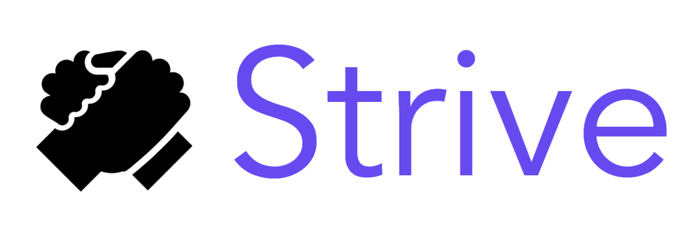
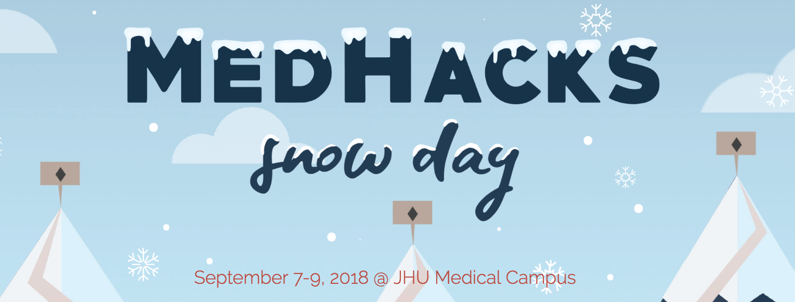
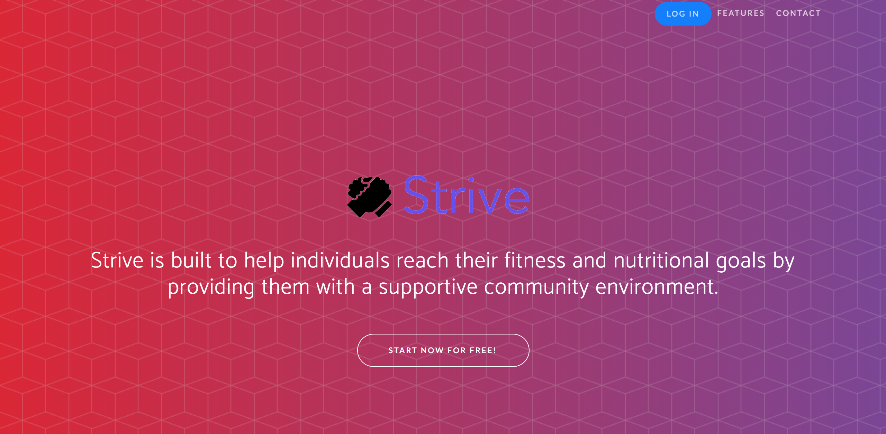
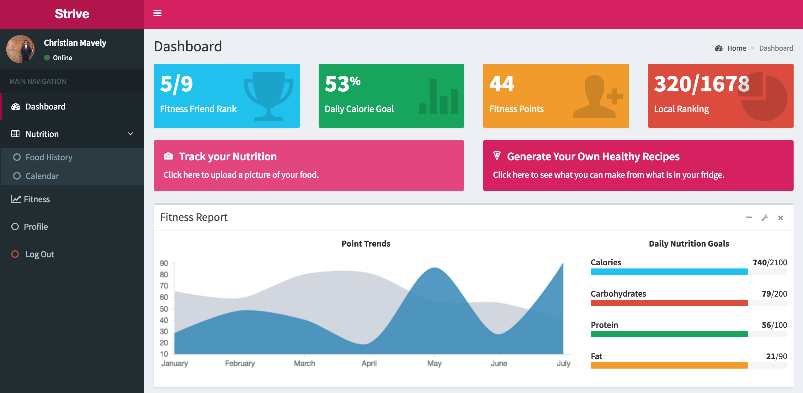
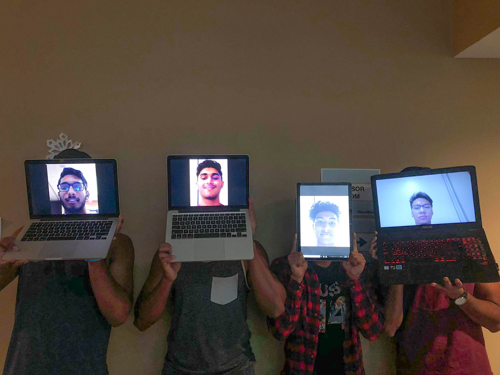

**Strive to do better.**
**Strive to be better** 

Strive is an application built at MedHacks 2018 that tackles the BlueCross BlueShield Association challenge of Community Health and Infrastructure. Strive won top 10 hack of 750 competitors at MedHacks 2018, the world's largest medical hackathon. 

## MedHacks 2018 -- John's Hopkins University

## About
The aim of Strive is to help individuals reach their fitness and nutritional goals by providing them with a supportive community environment.

### Strive allows you to:
* Connects you with peers in your zip code to enable you to form accountability groups
* Encourages friendly competition between you and your group of peers
* Uses computer vision to suggest healthy meals based on the ingredients you already have
* Allows you to easily and quickly track your food intake via Google Cloud Vision Recognition

## Screenshots

### Technology
* Google Firebase for the backend
* Google Cloud Vision API
* Twitter's Bootstrap Framework
* Fatsecret Nutritional API
* Spoonacular Recipe API

### Next Steps

We really hope to be able to continue this project and implement it on a local scale. Creating a group to track our own fitness and nutritional goals was one of the primary goals for this project, and we believe it's a good start. Beyond that, we truly believe this could help those without strong peer environments and positive influences a good way to find like-minded peers who share their goals and aspirations.

*Huge shoutout to the MedHacks team, including Fuad Ali, Christian Mavely, Aravin Sivakumar and Ryan Deus.*

